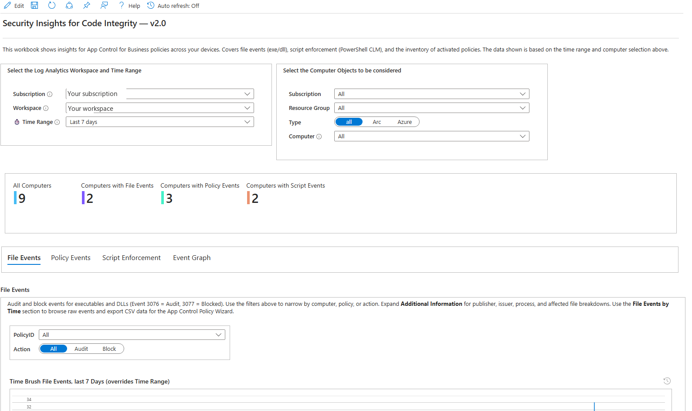
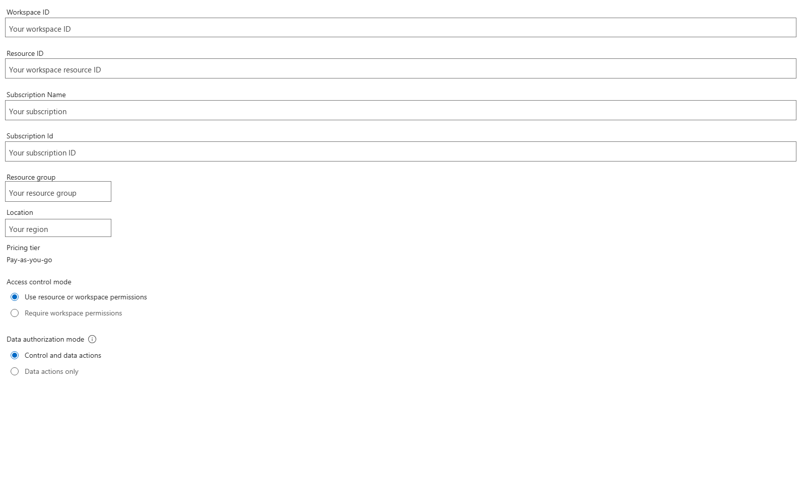
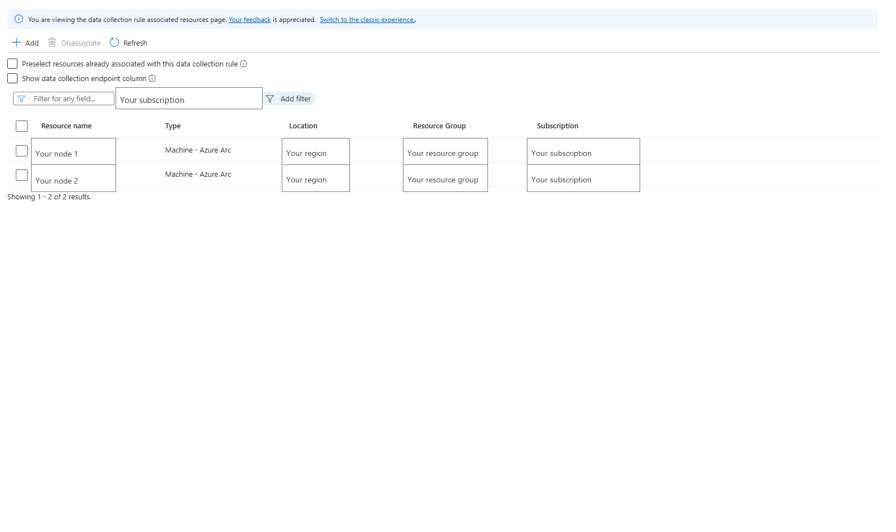
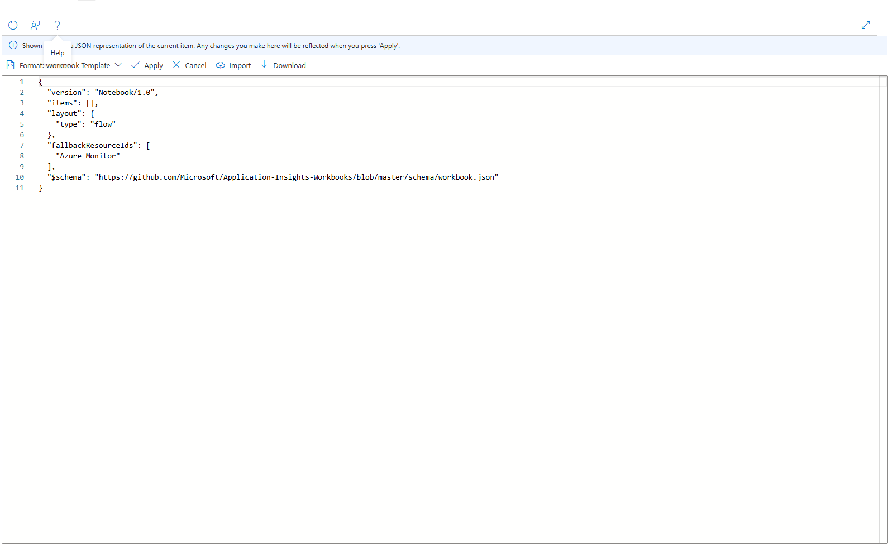
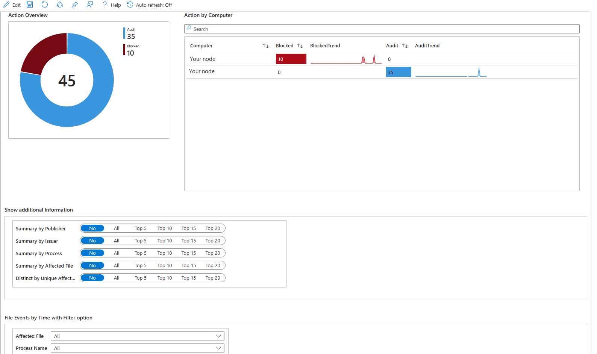
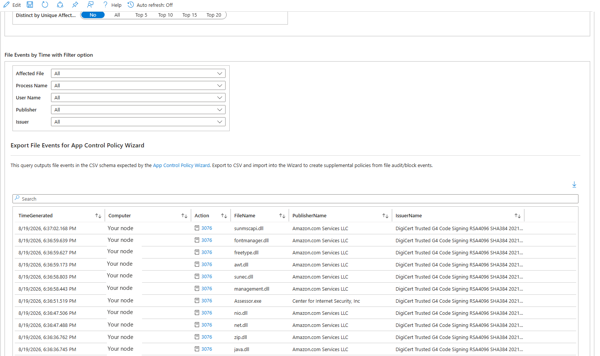
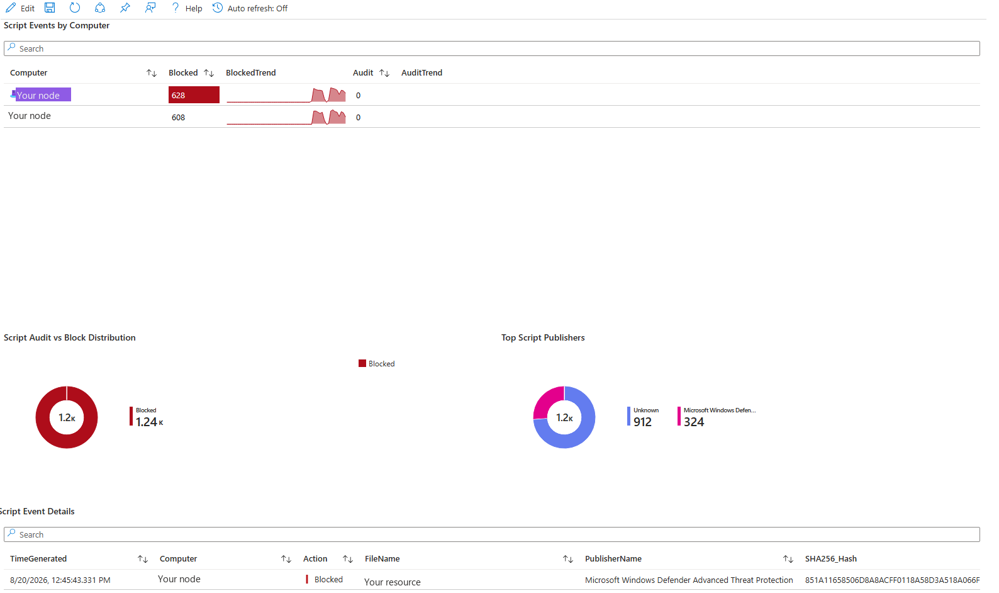
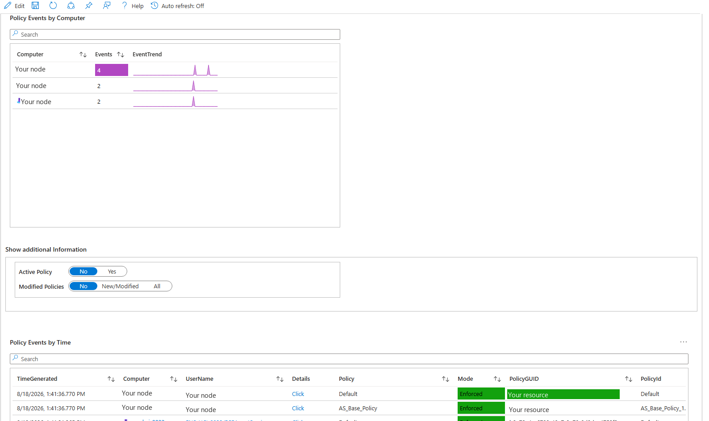
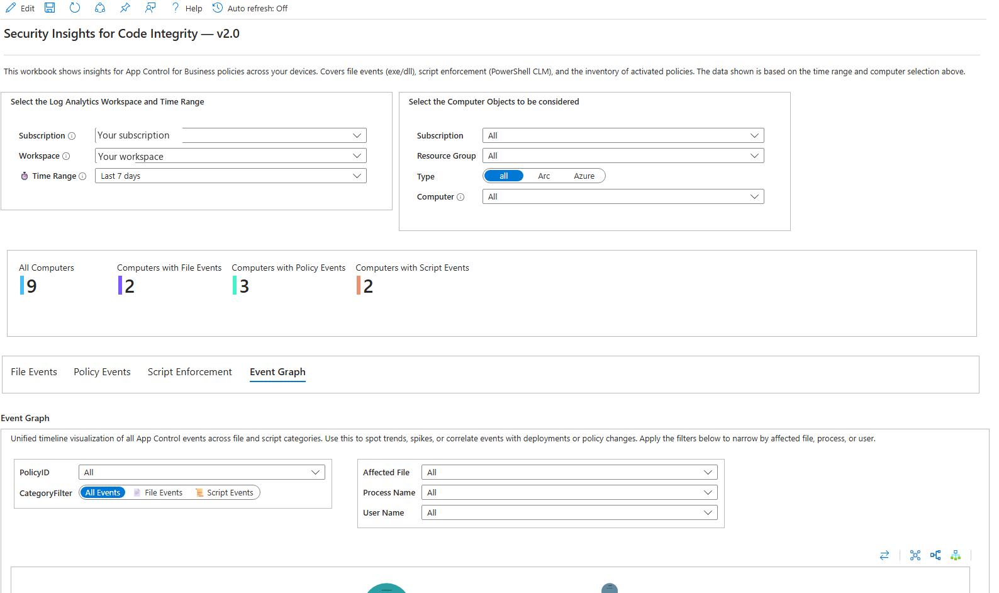
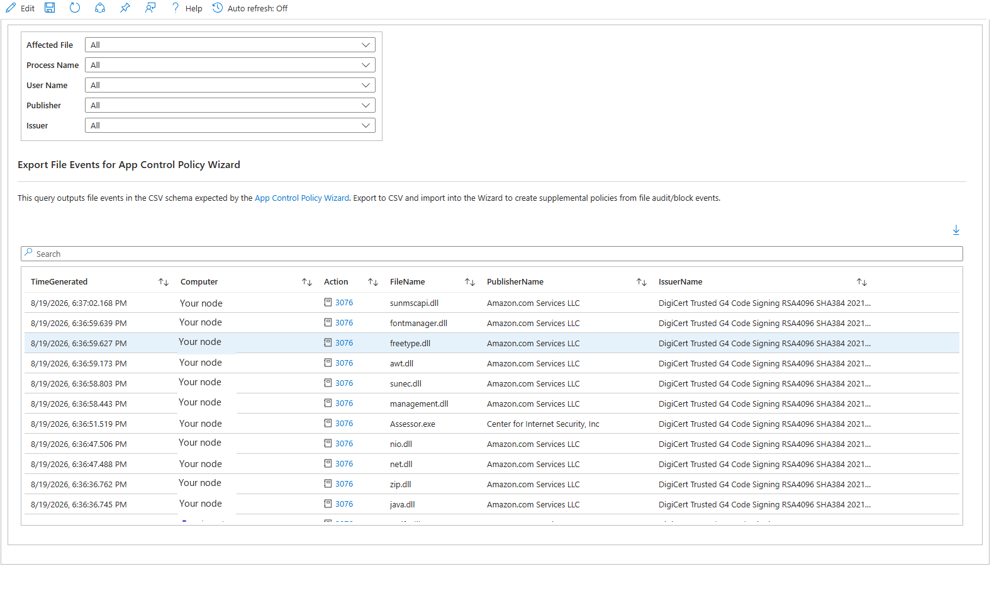

# How to Get Insights into App Control for Business Events

## Change History

| Version | Date | What |
|---------|------|------|
| v1.0 | 2024-04 | First version - DCR and Workbook for file events (3076/3077/3089/3099) |
| v1.1 | 2024-09 | Upgraded visualizations for file events. Updated documentation |
| v1.2 | 2025-01 | Upgraded workbook to handle SHA1 & SHA256 hashes |
| v1.3 | 2025-06 | Updated workbook to align CSV export columns with App Control Policy Wizard |
| v2.0 | 2026-08 | New **Script Enforcement** tab for PowerShell and MSI activity, including blocked COM classes. Improved publisher and issuer resolution on file events, with new summary views. Faster queries. CSV export for the App Control Policy Wizard. See [CHANGELOG.md](CHANGELOG.md) for details |

## Description

This scenario gives you insights into **App Control for Business** events collected from Windows machines.
The DCR and workbook work with any Azure VM or Azure Arc-enabled server emitting App Control for Business Windows events.

This scenario provides the following capabilities:

- **Collect** App Control events from your machines into a Log Analytics workspace using the Azure Monitor Agent.
- **Analyze** file, script and policy events through dashboards, charts, filters, and export capabilities to help troubleshoot App Control policy effects and status.
- **Refine policies** - export what you find to CSV and import it into the [App Control Policy Wizard](https://learn.microsoft.com/en-us/windows/security/application-security/application-control/app-control-for-business/design/wdac-wizard) to create or update a supplemental policy.

### Event Coverage

The DCR collects the eight events the workbook uses. Each is described in the [App Control event ID reference](https://learn.microsoft.com/en-us/windows/security/application-security/application-control/app-control-for-business/operations/event-id-explanations).

| EventID | Log Channel | Category | Description | App Control Wizard usage |
|---------|-------------|----------|-------------|--------------|
| 3076 | CodeIntegrity | File (exe/DLL) | Audit - the file would have been blocked | Creates rules |
| 3077 | CodeIntegrity | File (exe/DLL) | Block - the file was blocked | Creates rules |
| 3089 | CodeIntegrity | File signing | Signing details for a blocked or audited file | Enriches rules |
| 3099 | CodeIntegrity | Policy | A policy was loaded and activated | Not used |
| 8028 | AppLocker | Script/MSI | Audit - the script or MSI would have been blocked | Creates rules |
| 8029 | AppLocker | Script/MSI | Block - the script or MSI was blocked. PowerShell drops into Constrained Language Mode | Creates rules |
| 8036 | AppLocker | COM | A COM class was blocked because it is not in the policy's approved list | Not used |
| 8038 | AppLocker | Script signing | Signing details for a blocked or audited script | Enriches rules |

#### Using these events with the App Control Policy Wizard

File events and script events can be exported to CSV and imported into the App Control Policy Wizard to build or update a policy. Export file events on their own, script events on their own, or both together - the Wizard handles whichever it is given.

> [!NOTE]
> Script enforcement events require the latest version of the App Control Policy Wizard. Earlier versions read file events only and ignore script rows.

The signing events (`3089` and `8038`) do not create rules by themselves. The workbook merges their publisher and certificate details into the exported rows, so the Wizard can author publisher rules instead of falling back to file hashes.

Policy and COM events are there for investigation in the workbook and are not part of the export.

### Workbook Tabs

| Tab | Events | What It Shows |
|-----|--------|---------------|
| **File Events** | 3076, 3077, 3089 | Audit and block trends, activity per computer, top processes, publishers and issuers, a detailed event list, and CSV export |
| **Policy Events** | 3099 | Which policies are active on which machines, in audit or enforced mode, with their options decoded |
| **Script Enforcement** | 8028, 8029, 8036, 8038 | Script and MSI audit and block activity, script publishers, blocked COM classes, and CSV export |
| **Event Graph** | 3076, 3077, 8028, 8029 | A visual map from user to computer to action to the affected file |

<picture>
  <source media="(prefers-color-scheme: dark)" srcset="./picture/dark/workbook-overview.png">
  
</picture>

## Deployment

### Prerequisites

1. **Azure Arc-enabled servers** or **Azure VMs** - Connect hybrid machines to Azure using a [deployment script](https://learn.microsoft.com/en-us/azure/azure-arc/servers/onboard-portal).

2. **Azure Monitor Agent (AMA)** - [Deploy AMA on Arc-enabled servers](https://learn.microsoft.com/en-us/azure/azure-arc/servers/concept-log-analytics-extension-deployment) or enable the [VM extension from the Azure portal](https://learn.microsoft.com/en-us/azure/azure-arc/servers/manage-vm-extensions-portal).

3. **Log Analytics workspace** - Note your workspace ID and resource ID from [Log Analytics workspaces](https://portal.azure.com/#browse/Microsoft.OperationalInsights%2Fworkspaces) > **Properties**.

   

### Step 1 - Deploy the Data Collection Rule (DCR)

The DCR configures AMA to collect App Control events from two log channels:

- `Microsoft-Windows-CodeIntegrity/Operational` - file, policy and signing events
- `Microsoft-Windows-AppLocker/MSI and Script` - script enforcement, COM and script signing events

Events land in the **`WindowsEvent`** table. The workbook also reads any history already collected in the older `Event` table, so nothing you have today is lost.

Choose one of the following deployment methods:

#### Option A - Deploy to Azure (one-click)

<a href="https://portal.azure.com/#create/Microsoft.Template/uri/https%3A%2F%2Fraw.githubusercontent.com%2Fmicrosoft%2Fosconfig%2Fmain%2Fguides%2FHow%2520to%2520get%2520insights%2520into%2520App%2520Control%2520(WDAC)%2520events%2FDCR-AppControl.json" target="_blank"></a>

#### Option B - Azure CLI

```bash
az deployment group create \
  --resource-group <your-resource-group> \
  --template-uri "https://raw.githubusercontent.com/microsoft/osconfig/main/guides/How%20to%20get%20insights%20into%20App%20Control%20(WDAC)%20events/DCR-AppControl.json" \
  --parameters workspaceResourceId="<your-workspace-resource-id>"
```

#### Option C - Azure PowerShell

```powershell
New-AzResourceGroupDeployment `
  -ResourceGroupName "<your-resource-group>" `
  -TemplateUri "https://raw.githubusercontent.com/microsoft/osconfig/main/guides/How%20to%20get%20insights%20into%20App%20Control%20(WDAC)%20events/DCR-AppControl.json" `
  -workspaceResourceId "<your-workspace-resource-id>"
```

> [!IMPORTANT]
> After deploying the DCR, you must **assign it to your machines** to start collecting events:
> 1. Go to **Monitor > [Data Collection Rules](https://portal.azure.com/#view/Microsoft_Azure_Monitoring/AzureMonitoringBrowseBlade/~/dataCollectionRules)**.
> 2. Select the deployed DCR (default name: `DCR-AppControl`).
> 3. Go to **Configuration > Resources** and add your Arc-enabled servers or Azure VMs.
> 4. Select your server(s) and click **Apply**.

<picture>
  <source media="(prefers-color-scheme: dark)" srcset="./picture/dark/dcr-assignment.png">
  
</picture>

### Step 2 - Deploy the Workbook

Choose one of the following deployment methods:

#### Option A - Deploy to Azure (one-click)

<a href="https://portal.azure.com/#create/Microsoft.Template/uri/https%3A%2F%2Fraw.githubusercontent.com%2Fmicrosoft%2Fosconfig%2Fmain%2Fguides%2FHow%2520to%2520get%2520insights%2520into%2520App%2520Control%2520(WDAC)%2520events%2Fworkbook.json" target="_blank"></a>

#### Option B - Azure CLI

```bash
az deployment group create \
  --resource-group <your-resource-group> \
  --template-uri "https://raw.githubusercontent.com/microsoft/osconfig/main/guides/How%20to%20get%20insights%20into%20App%20Control%20(WDAC)%20events/workbook.json"
```

#### Option C - Azure PowerShell

```powershell
New-AzResourceGroupDeployment `
  -ResourceGroupName "<your-resource-group>" `
  -TemplateUri "https://raw.githubusercontent.com/microsoft/osconfig/main/guides/How%20to%20get%20insights%20into%20App%20Control%20(WDAC)%20events/workbook.json"
```

#### Option D - Paste into Portal (no ARM deployment required)

1. Open **[Azure Monitor > Workbooks](https://portal.azure.com/#view/Microsoft_Azure_Monitoring/AzureMonitoringBrowseBlade/~/workbooks)** > **New**.
2. Click the **Advanced Editor** button (`</>`).
3. Select the **Gallery Template** tab.
4. Paste the contents of [`workbook-portal.json`](workbook-portal.json).
5. Click **Apply**, then **Save**.

<picture>
  <source media="(prefers-color-scheme: dark)" srcset="./picture/dark/advanced-editor.png">
  
</picture>

## Using the Workbook

Once data is flowing (may take up to 1 hour after DCR assignment), open the workbook from **[Azure Monitor > Workbooks](https://portal.azure.com/#view/Microsoft_Azure_Monitoring/AzureMonitoringBrowseBlade/~/workbooks)** and search for **"App Control"**.


Navigate through the tabs to:

- **Identify potential threats** - files or scripts blocked or audited that may indicate malware or unauthorized software.
- **Track policy status** - which policies are deployed, in audit vs enforced mode, and policy change history.
- **Discover scripts affected by Constrained Language Mode** - PowerShell scripts audited or blocked by App Control script enforcement.
- **Visualize event relationships** - use the Event Graph tab to explore connections between users, computers, event categories, and affected files.
- **Refine policies** - export file events, script events, or both to CSV and import them into the [App Control Policy Wizard](https://learn.microsoft.com/en-us/windows/security/application-security/application-control/app-control-for-business/design/wdac-wizard) to create supplemental policies.

### File events

Review file audit and block activity over time and compare event counts across computers.

<picture>
  <source media="(prefers-color-scheme: dark)" srcset="./picture/dark/file-events.png">
  
</picture>

Expand the additional information section to summarize affected files by publisher and issuer.

<picture>
  <source media="(prefers-color-scheme: dark)" srcset="./picture/dark/publisher-summary.png">
  
</picture>

### Script enforcement

Review audit and block activity for scripts and MSI files, plus COM classes blocked by the policy's approved list.

<picture>
  <source media="(prefers-color-scheme: dark)" srcset="./picture/dark/script-enforcement.png">
  
</picture>

#### Reading the blocked COM classes (8036)

App Control enforces a **built-in allowlist of COM classes**. When a script host asks to create a class that is not on that list and not allowed by your policy, the request is refused and event `8036` records the CLSID.

This is normally the feature working as intended rather than a fault, which is why a machine reporting these blocks usually looks perfectly healthy:

- The refusal applies **only to the script host session** that asked. It does not unregister the class or block it anywhere else on the machine, so ordinary applications continue to create the same object without interference.
- The script that was refused typically handles the error or skips that branch. The visible result is reduced functionality inside that script, not a failed service or a failed boot.
- The event carries only two fields, `CLSID` and `IsApproved`. There is no file, process, user or policy name, and its correlation identifier does not link it to the script that triggered it. Treat it as a signal to investigate on the machine, not as a complete record.

Two classes commonly appear here because neither is on the built-in allowlist: **Windows Script Host Shell Object** (`wshom.ocx`, created from a script as `WScript.Shell`) and **UpdateSession Class** (`wuapi.dll`, created as `Microsoft.Update.Session`). Scripts that automate the shell or query Windows Update state are the usual source. Windows Update itself is a service and does not depend on a script creating that object.

The built-in list is documented in [Allow COM object registration in an App Control policy](https://learn.microsoft.com/en-us/windows/security/application-security/application-control/app-control-for-business/design/allow-com-object-registration-in-appcontrol-policy). The script-relevant entries are a short list - two classes from `scrrun.dll` (`FileSystemObject` and `Dictionary`), one from `vbscript.dll`, and two from `msxml6.dll` - while the bulk of the published table is driver test framework classes that no production script uses.

To allow a class you have decided to trust, take the CLSID from the workbook and add it to your policy, scoped to the host that needs it. Valid providers are `PowerShell`, `WSH`, `IE`, `VBA`, `MSI`, or `AllHostIds`:

```powershell
Set-CIPolicySetting -FilePath <path to policy>.xml `
                    -Provider PowerShell `
                    -Key "{72c24dd5-d70a-438b-8a42-98424b88afb8}" `
                    -ValueName EnterpriseDefinedClsId `
                    -ValueType Boolean `
                    -Value true
```

Deny rules work only in base policies. A class must pass every enforced policy on the machine, but needs to be allowed in only one policy in a base and supplemental set.

> **One failure mode produces no event at all.** When App Control is enforced, .NET refuses to load a COM object whose registration GUID does not match the one it calculates at runtime. The user sees a generic COM load error and **nothing is written to the log**. The allowlist described above does not affect that check. So an empty COM grid does not by itself prove that no COM problem exists. See [App Control admin tips and known issues](https://learn.microsoft.com/en-us/windows/security/application-security/application-control/app-control-for-business/operations/known-issues).

### Policy events

Review which policies are active on which machines, their mode, and their options. A machine with no rows here has not activated a policy.

<picture>
  <source media="(prefers-color-scheme: dark)" srcset="./picture/dark/policy-events.png">
  
</picture>

### Event graph

Explore relationships between users, computers, event categories, actions, processes, and affected files.

<picture>
  <source media="(prefers-color-scheme: dark)" srcset="./picture/dark/event-graph.png">
  
</picture>

### CSV export

Use the export grid on the File Events or Script Enforcement tab to download events, then import them into the App Control Policy Wizard.

<picture>
  <source media="(prefers-color-scheme: dark)" srcset="./picture/dark/csv-export.png">
  
</picture>

## Files

| File | Purpose |
|------|---------|
| `workbook.json` | ARM template - deploy via Azure CLI, PowerShell, or portal template deployment |
| `workbook-portal.json` | Gallery template JSON - paste directly into Workbooks Advanced Editor |
| `DCR-AppControl.json` | ARM template for the Data Collection Rule |
| `CHANGELOG.md` | Detailed changelog for each version |

## Related Resources

- [App Control for Business documentation](https://learn.microsoft.com/en-us/windows/security/application-security/application-control/app-control-for-business/)
- [App Control event ID reference](https://learn.microsoft.com/en-us/windows/security/application-security/application-control/app-control-for-business/operations/event-id-explanations)
- [App Control script enforcement](https://learn.microsoft.com/en-us/windows/security/application-security/application-control/app-control-for-business/design/script-enforcement)
- [App Control Policy Wizard](https://learn.microsoft.com/en-us/windows/security/application-security/application-control/app-control-for-business/design/wdac-wizard)
